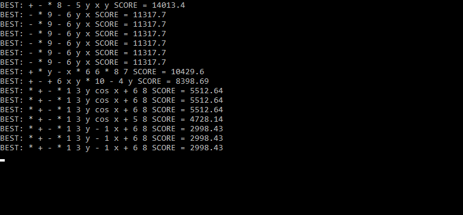

<h1>Genetic Algorithm</h1>

<h3>Description:</h3>
This program can find an approximate formula of the functions of two variables.
All we need is a text file in which every row we have a tuple (x; y; f (x, y)). (example in file test.txt)
The program draws formulas of functions and stores them in the form of trees.
Trees are mutated and crossed in each iteration. The longer the program works, the more approximate formula we get.

<h3>Screenshots:</h3>

